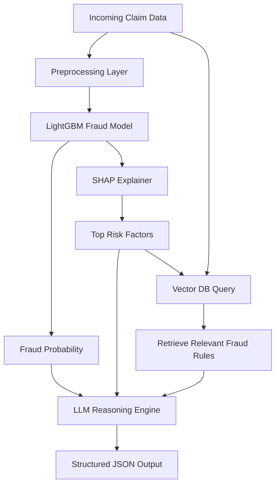

# 🛡️ Insurance Claims AI – Hybrid Fraud Detection System

An end-to-end AI-powered insurance fraud detection system combining:

- ✅ Machine Learning (LightGBM)
- ✅ Explainable AI (SHAP)
- ✅ Retrieval-Augmented Generation (RAG)
- ✅ Large Language Models (OpenAI)
- ✅ MLflow experiment tracking
- ✅ Dockerized deployment

This project demonstrates how traditional ML models can be enhanced using explainability techniques and LLM-based reasoning grounded in domain knowledge.

---

## 🚀 Project Overview

The system evaluates insurance claims and generates:

- Fraud probability score
- Risk level classification (Low / Medium / High)
- SHAP-based key risk factors
- Policy-backed justification
- Recommended investigation action

Unlike a typical fraud classifier, this project integrates:

- Predictive modeling
- Explainable AI (XAI)
- Vector database retrieval
- LLM reasoning
- Structured JSON outputs

---

## 🧠 System Workflow

1. A claim is passed into the prediction pipeline.
2. The LightGBM model predicts fraud probability.
3. SHAP explains which features contributed most.
4. A Vector DB retrieves relevant fraud rules.
5. An LLM combines:
   - Model prediction
   - SHAP risk factors
   - Retrieved fraud policies
6. The system returns a structured JSON investigation report.

---

## 🏗 Architecture



---

# 🛠 Tech Stack
## 🔹 Modeling

    - Python 3.10

    - LightGBM

    - scikit-learn

## 🔹 Explainability

    - SHAP

## 🔹 RAG Layer

    - ChromaDB

    - sentence-transformers

## 🔹 LLM

    - OpenAI GPT-4o-mini

## 🔹 MLOps

    - MLflow

## 🔹 Deployment

    - Docker

---

# Project Structure
```mermaid
insurance-claims-ai/
│
├── ml/
│   ├── preprocess.py        # Feature preprocessing
│   ├── train.py             # Model training + MLflow logging
│   ├── predict.py           # Prediction + SHAP explanations
│
├── rag/
│   ├── vector_store.py      # Vector DB setup
│   ├── retriever.py         # Context-aware rule retrieval
│   └── load_rules.py        # Load fraud rules into DB
│
├── models/
│   ├── lgbm_model.pkl
│   ├── preprocess.pkl
│   └── shap_explainer.pkl
│
├── requirements.txt
├── Dockerfile
└── README.md
```

---

# Quick Start
## 1. Clone the repository
```bash
git clone https://github.com/<your-username>/insurance-claims-ai.git
cd insurance-claims-ai.git
```

## 2. Create a virtual environment
```bash
conda create -n insurance-ai python=3.10
conda activate insurance-ai
pip install -r requirements.txt
```

## 3. Train the Model
```bash
python ml/train.py
```
- Train the LightGBM classifier
- Log experiments to MLflow
- Save the model and SHAP explainer in ```/models```

## 4. Load Fraud Rules into Vector DB
```bash
python rag/load_rules.py
```

## 5. Set OpenAI API Key
Create a ```.env``` file in the root directory:
```ini
OPENAI_API_KEY=your_api_key_here
```

## 6. Run the Fraud Investigation Agent
You can now run the full AI pipeline:
```python
from agent import investigate_claim

sample_claim = {
    "Month": "Sep",
    "WeekOfMonth": "3",
    "DayOfWeek": "Saturday",
    "Make": "Ford",
    "AccidentArea": "Urban",
    "DayOfWeekClaimed": "Sunday",
    "MonthClaimed": "Sep",
    "WeekOfMonthClaimed": "3",
    "Sex": "Male",
    "MaritalStatus": "Married",
    "Age": 34,
    "Fault": "Policy Holder",
    "PolicyType": "Utility - All Perils",
    "VehicleCategory": "Utility",
    "VehiclePrice": "30000 to 39000",
    "Deductible": 400,
    "DriverRating": 2,
    "Days_Policy_Accident": "15 to 30",
    "Days_Policy_Claim": "15 to 30",
    "PastNumberOfClaims": "1",
    "AgeOfVehicle": "3 years",
    "AgeOfPolicyHolder": "31 to 40",
    "PoliceReportFiled": "Yes",
    "WitnessPresent": "No",
    "AgentType": "External",
    "NumberOfSuppliments": "1 to 2",
    "NumberOfCars": "2 vehicles",
    "BasePolicy": "All Perils"
}

result = investigate_claim(sample_claim)
print(result)

```
This runs:
* Model prediction
* SHAP explanation
* Vector DB retrieval
* LLM reasoning
* Structured JSON output

---

## Example Output
```json
{
	"risk_level": "low",
	"fraud_probability": 0.18662582553118529,
	"key_risk_factors": [
		"Fault : Policy Holder",
		"PoliceReportFiled : Yes",
		"BasePolicy : All Perils",
		"Make : Ford",
		"Age : 34"
	],
	"justification": "The fraud probability is low at 0.1866, and the key risk factors indicate that the fault lies with the policy holder, which is a common scenario in legitimate claims. Additionally, the presence of a police report filed supports the legitimacy of the claim.",
	"recommended_action": "Approve"
}
```