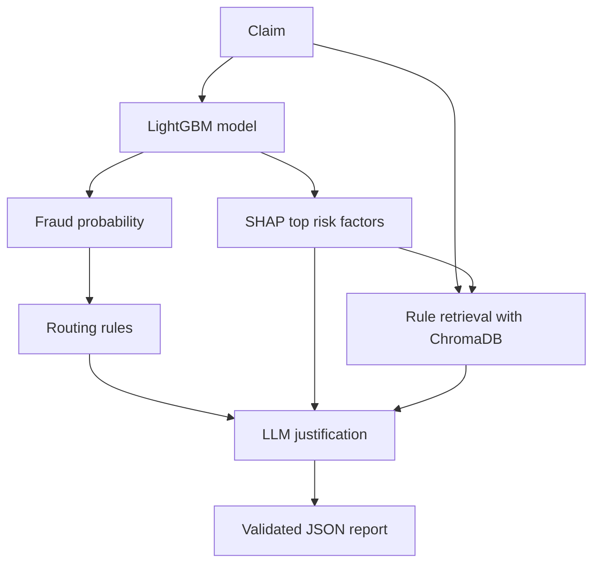

# Insurance Claims AI: Hybrid Fraud Detection

Fraud scoring for vehicle insurance claims that combines a LightGBM model, SHAP explanations, retrieval over a small set of fraud rules, and an LLM that writes a justification for investigators. The decision about what happens to a claim is made by code, not by the LLM.

## How it works

1. LightGBM predicts the probability that a claim is fraudulent.
2. SHAP picks out the five features that contributed most to that score.
3. The claim and its top factors are used to retrieve the most relevant fraud rules from a small knowledge base, embedded into an in-memory ChromaDB collection when the app starts.
4. Routing rules turn the probability into an action (see Human review routing below).
5. GPT-4o-mini writes a short justification for that decision. Its reply is validated with Pydantic.


```mermaid
flowchart TD
    A[Claim] --> B[LightGBM model]
    B --> C[Fraud probability]
    B --> D[SHAP top risk factors]
    A --> E[Rule retrieval with ChromaDB]
    D --> E
    C --> F[Routing rules]
    F --> G[LLM justification]
    D --> G
    E --> G
    G --> H[Validated JSON report]
```

## API

| Method | Endpoint | What it does |
|---|---|---|
| GET | `/health` | Service status |
| POST | `/predict` | Model only: fraud probability, risk level and top SHAP factors. No LLM call |
| POST | `/investigate` | Full pipeline: routing decision plus an LLM-written justification |

Interactive docs are at `/docs`, with an example claim already filled in.

## Example

`POST /investigate` with the example claim returns:

```json
{
  "risk_level": "low",
  "fraud_probability": 0.1866,
  "key_risk_factors": [
    "Fault : Policy Holder",
    "PoliceReportFiled : Yes",
    "BasePolicy : All Perils",
    "Make : Ford",
    "Age : 34"
  ],
  "justification": "The fraud probability is low at 0.1866, and the key risk factors indicate that the fault lies with the policy holder, which is a common scenario in legitimate claims. Additionally, the presence of a police report filed supports the legitimacy of the claim.",
  "recommended_action": "Approve",
  "needs_human_review": false
}
```

## Human review routing

Routing is decided by code, not by the LLM. `agent/fraud_agent.py` turns the model's fraud probability into an action:

| Fraud probability | Action | Human review |
|---|---|---|
| Below 0.3 | Approve | No |
| 0.3 to 0.7 | Manual Review | Yes |
| 0.7 and above | Escalate Investigation | Yes |

- No claim is ever rejected automatically. Rejection is always a human decision.
- The LLM only writes the justification. It cannot change the action, the probability or the risk level.
- The LLM's reply is validated against a Pydantic schema. If the call fails, the API key is missing, or the reply doesn't match, the claim goes to manual review.
- The thresholds match the model's risk bands. In real use they should be tuned on validation data, balancing missed fraud against reviewer workload.

## Fairness and limitations

The dataset includes `Sex`, `MaritalStatus`, `Age` and `AgeOfPolicyHolder`, and the model uses them as features. These relate to protected characteristics under the UK Equality Act 2010, and in the example above, `Age` is one of the top five factors behind the score. A model like this could flag some groups of customers more often than others without good reason.

What this project does about it:
- No claim is rejected automatically, and medium and high-risk claims always go to a person.
- SHAP factors come with every decision, so a reviewer can see when a protected characteristic is driving the score.

What it does not do yet:
- Compare false positive rates across groups, such as by sex or age band.
- Retrain without the protected attributes and measure the effect on performance.

Both would be needed before this approach was suitable for real use.

The knowledge base is also deliberately small: five hand-written rules in `rag/fraud_rules.txt`. Retrieval here demonstrates the pattern rather than searching real policy documents.

## Quick start

=======
# Quick Start
## 1. Clone the repository
```bash
git clone https://github.com/IAmSahilVerma/insurance-claims-ai
cd insurance-claims-ai
```

## 2. Create a virtual environment
```bash
conda create -n insurance-ai python=3.10
conda activate insurance-ai
pip install -r requirements.txt
```

Create a `.env` file in the root directory with your OpenAI key:

```ini
OPENAI_API_KEY=your_api_key_here
```

Without a key, `/predict` still works and `/investigate` sends every claim to manual review.

Run the API, then open [http://localhost:8000/docs](http://localhost:8000/docs):

```bash
uvicorn api.main:app --reload
```

To retrain the model (optional):

```bash
python ml/train.py
```

### Run with Docker

```bash
docker build -t insurance-claims-ai .
docker run -p 8000:8000 -e OPENAI_API_KEY=your_api_key_here insurance-claims-ai
```

### Use from Python

```python
from agent.fraud_agent import investigate_claim

result = investigate_claim(claim)  # claim is a dict with the fields shown in /docs
```

## Project structure

```text
insurance-claims-ai/
├─ agent/fraud_agent.py   # Routing, LLM justification, output validation
├─ api/main.py            # FastAPI service
├─ ml/
│   ├─ preprocess.py      # Feature preprocessing
│   ├─ train.py           # LightGBM training with MLflow logging
│   └─ predict.py         # Prediction and SHAP explanations
├─ rag/
│   ├─ fraud_rules.txt    # Fraud rules knowledge base
│   ├─ vector_store.py    # In-memory ChromaDB, rules loaded at startup
│   └─ retriever.py       # Retrieves the rules most relevant to a claim
├─ models/                # Trained LightGBM model and preprocessing info
├─ Dockerfile
└─ requirements.txt
```

## Tech stack

Python, LightGBM, SHAP, ChromaDB, sentence-transformers, OpenAI GPT-4o-mini, FastAPI, Pydantic, MLflow, Docker
=======
## Example Output
```json
{
	"risk_level": "low",
	"fraud_probability": 0.18662582553118529,
	"key_risk_factors": [
		"Fault : Policy Holder",
		"PoliceReportFiled : Yes",
		"BasePolicy : All Perils",
		"Make : Ford",
		"Age : 34"
	],
	"justification": "The fraud probability is low at 0.1866, and the key risk factors indicate that the fault lies with the policy holder, which is a common scenario in legitimate claims. Additionally, the presence of a police report filed supports the legitimacy of the claim.",
	"recommended_action": "Approve",
    "needs_human_review": false
}
```
